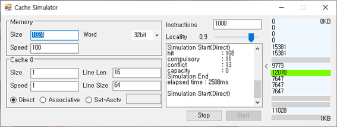
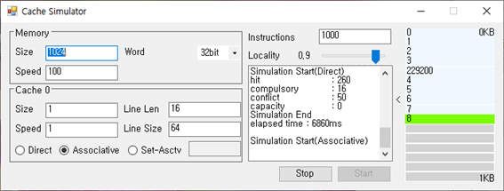
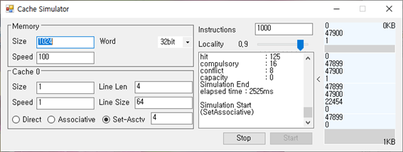

# Cache-Simulator
GUI Cache Simulator

Dongguk univ. Computer Architecture assignment

[] Looking algorithm to memory block
[] Set associative memory inherits from associative cache
[] Better random address generator
[] Add multiple victim algorithm
[] Refactoring

# Explain

COPYRIGHT 2019. JeongWon Her ALL RIGHTS RESERVED.
